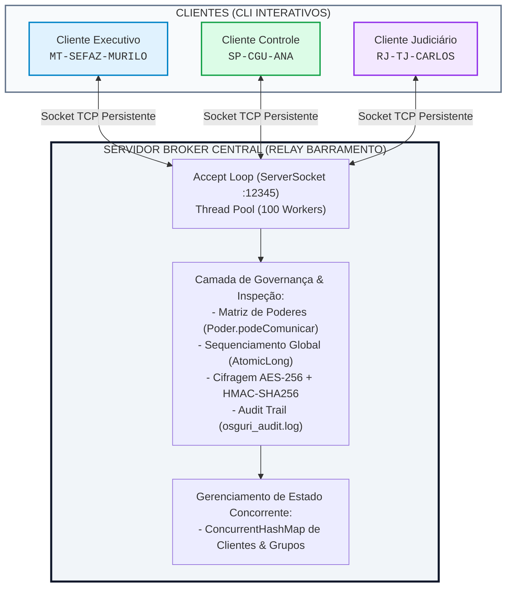

# DOCUMENTO DE ESPECIFICAÇÃO DE ARQUITETURA DE SISTEMA DISTRIBUÍDO
## Sistema de Comunicação Corporativa Governamental – Protocolo OSGURI

**Projeto:** Prova de Conceito (PoC) e Especificação Arquitetural do Chat Corporativo Governamental  
**Protocolo de Aplicação:** OSGURI (Open Secure Government Unified Relay Interface)  
**Protocolo de Transporte:** TCP (`java.net.Socket`, `java.net.ServerSocket`)  
**Tecnologia:** Java 21 LTS (Standard Edition - Sem Frameworks Externos), Docker, Docker Compose  
**Público-Alvo:** Engenheiros de Software (Nível Pleno / Sênior) e Avaliadores Técnicos  
**Instituição:** Universidade Federal de Mato Grosso (UFMT) – Instituto de Computação  

---

## 1. VISÃO GERAL E CONTEXTO OPERACIONAL

O sistema **OSGURI** foi projetado para atender aos requisitos de soberania digital, governança corporativa e segurança da informação para uma federação hipotética composta por mais de 30 estados. O ecossistema abrange quatro esferas governamentais distintas: **Poder Executivo**, **Poder Legislativo**, **Poder Judiciário** e **Órgãos de Controle e Fiscalização** (ex: CGU, TCU, TCEs).

A finalidade deste documento é especificar detalhadamente a arquitetura de software, o protocolo de camada de aplicação, o modelo de concorrência, as estratégias de segurança e a ordenação de eventos distribuídos, permitindo que uma equipe de engenharia de software de nível pleno compreenda, mantenha ou evolua a solução sem necessidade de contato direto com os autores iniciais.

---

## 2. ESPECIFICAÇÃO GERAL DA ARQUITETURA DISTRIBUÍDA

### 2.1 Padrão Arquitetural
A solução adota o padrão **Cliente-Servidor Mediado por Broker (Relay Broker Centralizado)** sobre conexões Sockets TCP persistentes.



#### Decisão Arquitetural: Broker Centralizado vs. Peer-to-Peer (P2P)
* **Motivação:** Em redes P2P puras, a aplicação de regras corporativas e o registro de não-repúdio dependem da honestidade das pontas. Um cliente adulterado poderia burlar restrições de comunicação entre Poderes ou forjar relógios locais.
* **Solução:** O `ServidorBroker` centraliza a inspeção de pacotes, roteamento, validação de restrições de Poderes e sequenciamento global, garantindo que o barramento de comunicação seja rigorosamente controlado.

---

### 2.2 Protocolos de Transporte e Aplicação
* **Camada de Transporte:** **TCP (Transmission Control Protocol)** via Sockets nativos (`java.net.Socket`, `java.net.ServerSocket`). Garante entrega ordenada e confiável de bytes sem perda de pacotes no nível de rede.
* **Camada de Aplicação:** **Protocolo OSGURI**, um protocolo textual customizado codificado em UTF-8, estruturado em envelopes delimitados pelo caractere pipe (`|`) e finalizados por quebra de linha (`\n`).

---

### 2.3 Modelo de Comunicação
* **Orientado a Mensagens (Message-Driven / Relay):** A comunicação entre clientes ocorre de forma indireta. Os clientes postam envelopes no Broker, que resolve o endereço do destinatário e despacha a mensagem.
* **Asassincronismo no Cliente:** O cliente de terminal (`ClienteCLI`) opera com concorrência interna:
  - **Thread de Entrada (UI):** Lê comandos do teclado e escreve no Socket de forma síncrona.
  - **Thread de Escuta (`escutarBroker`):** Bloqueia no `BufferedReader` do Socket e processa mensagens recebidas em tempo real sem travar a digitação do usuário.
* **Concorrência do Servidor:** O servidor utiliza o padrão **Worker Thread Pool** (`Executors.newFixedThreadPool(100)`), alocando uma tarefa `Runnable` (`ClienteHandler`) para cada conexão ativa.

---

### 2.4 Interfaces entre Módulos e Estrutura de Pacotes

```text
c:\Users\Muril\chat-corporativo\src\br\ufmt\osguri\
├── protocolo/
│   ├── Poder.java            -> Enumeração de Poderes e Matriz Restritiva Inter-Poderes
│   ├── RelogioVetorial.java  -> Implementação de Relógio Vetorial para Ordenação Causal
│   ├── CriptografiaUtil.java -> Utilitário de Cifragem AES-256 e Assinatura HMAC-SHA256
│   ├── ProtocoloOSGURI.java  -> Definição de Constantes e Comandos do Protocolo
│   └── MensagemOSGURI.java   -> DTO Envelope (Serialização e Desserialização)
├── broker/
│   ├── Grupo.java            -> Entidade de Gerenciamento de Grupos (Institucionais/Privados)
│   ├── LoggerNaoRepudio.java -> Serviço de Auditoria Imutável (Arquivo e Memória)
│   ├── ClienteHandler.java   -> Worker de Atendimento (Runnable) alocado no Thread Pool
│   └── ServidorBroker.java   -> Servidor Principal (ServerSocket e Sequenciador Global)
└── client/
    └── ClienteCLI.java       -> Aplicação Terminal Interativa (Main UI + Listener Thread)
```

---

### 2.5 Detalhamento das Funções, Métodos e Serviços por Componente

#### Módulo `br.ufmt.osguri.broker`
1. **`ServidorBroker`**
   - `iniciar()`: Inicializa o `ServerSocket` na porta configurada e dispara a malha de aceitação de conexões (`accept()`).
   - `registrarCliente(String id, ClienteHandler handler)`: Adiciona um cliente autenticado no mapa concorrente `clientesConectados`.
   - `removerCliente(String id)`: Remove o cliente desconectado e limpa referências.
   - `gerarTimestampGlobal()`: Incrementa e retorna atomicamente a sequência lógica global via `AtomicLong.incrementAndGet()`.
   - `criarGrupo(...)` / `entrarGrupo(...)`: Gerencia o ciclo de vida e entrada de membros em grupos.
2. **`ClienteHandler`**
   - `run()`: Loop principal da thread trabalhadora que lê linhas do socket cliente, desserializa em `MensagemOSGURI` e invoca `processarMensagem()`.
   - `processarLogin(MensagemOSGURI msg)`: Valida credenciais e cadastra o usuário no servidor.
   - `processarMsg(MensagemOSGURI msg)`: Avalia permissões entre Poderes (`Poder.podeComunicar`), gera ordenação global, grava auditoria e repassa a mensagem.
3. **`Grupo`**
   - `adicionarMembro(String usuarioId, Poder poderUsuario)`: Valida se o usuário possui permissão para ingressar (em grupos institucionais, restrito ao mesmo Poder do criador ou Poder de Controle).
4. **`LoggerNaoRepudio`**
   - `registrarLog(...)`: Grava o evento na lista de memória e no arquivo físico `osguri_audit.log` de forma thread-safe.

#### Módulo `br.ufmt.osguri.protocolo`
1. **`Poder` (Enum)**
   - `podeComunicar(Poder origem, Poder destino)`: Método estático determinístico que implementa a matriz de regras institucionais entre Poderes.
   - `inferirPoder(String orgao)`: Heurística para deduzir o Poder a partir de siglas de órgãos (ex: `TJ` -> `JUDICIARIO`, `CGU` -> `CONTROLE`).
2. **`MensagemOSGURI`**
   - `serializar()`: Converte o objeto em linha de texto cifrada em AES-256 e com assinatura HMAC-SHA256 anexada.
   - `desserializar(String linha)`: Valida a assinatura HMAC, decifra o conteúdo sensível e recria o objeto Java.
3. **`CriptografiaUtil`**
   - `cifrarAES(String texto, String chave)` / `decifrarAES(...)`: Cifragem simétrica AES-256 (Base64).
   - `gerarHMAC(String dados, String chave)`: Cálculo de hash autenticado usando `HmacSHA256`.
4. **`RelogioVetorial`**
   - `incrementar(String processoId)` / `merge(RelogioVetorial outro)`: Mantém e funde vetores lógicos para ordenação causal em históricos.

#### Módulo `br.ufmt.osguri.client`
1. **`ClienteCLI`**
   - `main(...)`: Ponto de entrada do cliente, coleta informações de Login, abre o Socket e dispara a thread `escutarBroker`.
   - `escutarBroker()`: Thread secundária que recebe e exibe notificações e mensagens em tempo real.
   - `salvarArquivoRecebido(...)`: Reconstitui arquivos enviados em Base64 e salva no diretório `downloads/`.

---

## 3. ANÁLISE DE TRANSPARÊNCIA DISTRIBUÍDA

O sistema oferece diferentes níveis de transparência conforme os conceitos de Tanenbaum & Van Steen:

| Tipo de Transparência | Nível de Suporte | Detalhamento Técnico no OSGURI |
| :--- | :---: | :--- |
| **Transparência de Acesso** | **Total** | Clientes e Servidores trocam envelopes abstratos `MensagemOSGURI`. A codificação de arquivos em Base64 e a cifragem AES ocorrem de forma invisível para o usuário final. |
| **Transparência de Localização** | **Total** | Os clientes não precisam saber o endereço IP/Porta dos outros participantes. Todos se conectam ao ID normalizado (`ESTADO-ORGAO-NOME`) via Broker. |
| **Transparência de Concorrência** | **Total** | Múltiplos clientes enviam mensagens e criam grupos em paralelo sem colisão de estado, graças às estruturas `ConcurrentHashMap` e `AtomicLong` do Broker. |
| **Transparência de Falha** | **Parcial** | Em caso de desconexão de um cliente, o Broker intercepta a quebra da conexão Socket, remove o usuário da lista online e notifica eventuais remetentes com erro `DESTINATARIO_INDISSPONIVEL`. |
| **Transparência de Replicação** | **N/A (PoC)** | Na versão PoC atual, o Broker é um nó único. Em ambiente federado, a replicação entre Brokers será transparente para o cliente. |

---

## 4. ESCALABILIDADE, ALTA DISPONIBILIDADE E TOLERÂNCIA A FALHAS

### 4.1 Escalabilidade Vertical (Scale-Up)
* **Limitação de Threads:** O uso de `Executors.newFixedThreadPool(100)` impõe um teto de 100 conexões concorrentes ativas por nó de Broker.
* **Otimização:** Em máquinas de alto desempenho, este valor pode ser ajustado na configuração do Broker. A migração futura para **Java Virtual Threads (Project Loom)** (`Executors.newVirtualThreadPerTaskExecutor()`) permitirá escalar para centenas de milhares de conexões simultâneas com baixo consumo de RAM.

### 4.2 Escalabilidade Horizontal (Scale-Out e Federação de Brokers)
Para suportar o crescimento nacional (30+ estados com milhões de servidores públicos), o sistema foi projetado para permitir uma **Federação de Brokers**:

```text
[ Cluster Estadual MT ]                 [ Barramento Central ]                 [ Cluster Estadual SP ]
+---------------------+                 +--------------------+                 +---------------------+
| Broker Regional MT  | <=============> |  Cluster Kafka /   | <=============> | Broker Regional SP  |
|  (Sockets Locais)   |  Pub/Sub Relays |  Redis Cluster     |  Pub/Sub Relays |  (Sockets Locais)   |
+---------------------+                 +--------------------+                 +---------------------+
```

* **Mecanismo:** Cada estado/órgão executa seu próprio cluster de Brokers regionais.
* **Inter-broker Relay:** Brokers comunicam-se entre si via barramento interno Pub/Sub (ex: Redis Pub/Sub ou Apache Kafka) ou sockets dedicados Broker-to-Broker.
* **Endereçamento Global:** O formato de ID `ESTADO-ORGAO-NOME` permite rotear pacotes para o Broker regional correto sem sobreatcarregar o nó central.

### 4.3 Tolerância a Falhas e Detecção de Conexões Mortas
* **Detecção de Desconexão Abrupta:** O `ClienteHandler` captura exceções de `IOException` ou fim de stream (`null` no `readLine()`), disparando rotinas de limpeza para fechar o socket e liberar o usuário do mapa de conectados.
* **Prevenção de Deadlocks:** O uso de locks finos ou coleções sem trava (`ConcurrentHashMap`) evita condições de corrida durante logins ou desregistros simultâneos.

---

## 5. ESPECIFICAÇÃO DO PROTOCOLO OSGURI (CAMADA DE APLICAÇÃO)

### 5.1 Formato do Envelope no Barramento TCP
O envelope é transmitido como uma única linha de texto delimitada por pipe (`|`):

```text
TIPO|REMETENTE|DESTINO|TIMESTAMP_LOGICO|CONTEUDO_CIFRADO|HMAC_SIGNATURE
```

```text
+----------------------------------------------------------------------------------------------------+
|                                    ESTRUTURA DO ENVELOPE OSGURI                                    |
+---------------+-----------------+---------------+------------------+-------------------+-----------+
| TIPO          | REMETENTE       | DESTINO       | TIMESTAMP_LOGICO | CONTEUDO_CIFRADO  | HMAC      |
| (Operação)    | (ID Origem)     | (ID Destino)  | (Seq. Global)    | (AES-256 Base64)  | (SHA-256) |
+---------------+-----------------+---------------+------------------+-------------------+-----------+
| MSG           | MT-SEFAZ-MURILO | SP-CGU-ANA    | 42               | k9aX8Qj2m...==    | aF31b9... |
+---------------+-----------------+---------------+------------------+-------------------+-----------+
```

### 5.2 Catálogo de Operações

| Tipo de Comando | Descrição do Payload (`CONTEUDO_CIFRADO`) | Resposta Esperada |
| :--- | :--- | :--- |
| `LOGIN` | `ID\|Nome\|Órgão\|Poder` | `OK` ou `ERRO` |
| `MSG` | Texto cifrado da mensagem privada | `OK` (remetente) + `MSG` (destino) |
| `ARQUIVO` | `nomeArquivo.ext\|ConteudoEmBase64` | `OK` (remetente) + `ARQUIVO` (destino) |
| `ONLINE` / `BUSCA` | Solicitante (`LISTAR`) | `OK\|lista_usuarios_separados_por_virgula` |
| `GRUPO_CRIAR` | `NomeGrupo\|INSTITUCIONAL` ou `NomeGrupo\|PRIVADO` | `OK` ou `ERRO` |
| `GRUPO_ENTRAR` | `NomeGrupo` | `OK` ou `ERRO` |
| `GRUPO_MSG` | `NomeGrupo\|TextoMensagem` | `OK` + Distribuição para membros |
| `HISTORICO` | Solicitação de trilha de eventos | `OK\|historico_formatado` |

---

## 6. GOVERNANÇA E MATRIZ DE RESTRIÇÃO ENTRE PODERES

### 6.1 Matriz de Comunicação (`Poder.podeComunicar`)

| Origem \ Destino | EXECUTIVO | LEGISLATIVO | JUDICIÁRIO | CONTROLE |
| :--- | :---: | :---: | :---: | :---: |
| **EXECUTIVO** | ✅ PERMITIDO | ❌ BLOQUEADO | ❌ BLOQUEADO | ✅ PERMITIDO |
| **LEGISLATIVO** | ❌ BLOQUEADO | ✅ PERMITIDO | ❌ BLOQUEADO | ✅ PERMITIDO |
| **JUDICIÁRIO** | ❌ BLOQUEADO | ❌ BLOQUEADO | ✅ PERMITIDO | ✅ PERMITIDO |
| **CONTROLE** | ✅ PERMITIDO | ✅ PERMITIDO | ✅ PERMITIDO | ✅ PERMITIDO |

```java
// Poder.java - Implementação da Governança
public static boolean podeComunicar(Poder origem, Poder destino) {
    if (origem == null || destino == null) return false;
    if (origem == CONTROLE || destino == CONTROLE) return true;
    return origem == destino;
}
```

* **Regra de Bloqueio:** Se um cliente do `EXECUTIVO` tentar enviar uma mensagem privada para o `JUDICIARIO`, o Broker intercepta e retorna o erro:  
  `[ERRO/RESTRIÇÃO] BLOQUEIO ENTRE PODERES: Comunicacao direta proibida entre EXECUTIVO e JUDICIARIO`.

### 6.2 Regras de Grupos Institucionais vs. Privados
* **Grupo Privado:** Acesso livre para qualquer usuário cadastrado no sistema.
* **Grupo Institucional:** Restrito. Um usuário do Executivo só pode criar grupos do Executivo. Apenas membros do mesmo Poder (ou usuários do Poder de Controle) têm permissão de ingresso.

---

## 7. ORDENAÇÃO LÓGICA DE EVENTOS E HISTÓRICO CAUSAL

### 7.1 Sequenciamento Global Monotônico no Broker
O `ServidorBroker` atua como fonte única da verdade para a sequência de eventos. Cada mensagem processada chama `gerarTimestampGlobal()`, alimentada por um `AtomicLong`. Esse número sequencial (ex: `1`, `2`, `3`...) é carimbado no campo `TIMESTAMP_LOGICO` do envelope e gravado no log de auditoria.

### 7.2 Relógio Vetorial (`RelogioVetorial`)
Para cenários de ordenação causal distribuída entre clientes, o sistema inclui a classe `RelogioVetorial`. Cada processo mantém um mapa de contadores `<ProcessoID, Contador>`.
Ao enviar mensagens, o cliente inclui o estado serializado de seu vetor local (ex: `MT-SEFAZ-MURILO:3,SP-CGU-ANA:1`). Ao receber, o cliente executa o *merge* mantendo os valores máximos e incrementa seu próprio ponteiro. O histórico local ordena os eventos comparando a dominância dos vetores lógicos.

---

## 8. ARQUITETURA DE SEGURANÇA E AUDITORIA

### 8.1 Confidencialidade (AES-256)
* Cifragem simétrica com **AES-256 (ECB / PKCS5Padding)** aplicada sobre o conteúdo útil da mensagem antes do envio pelo Socket.
* Garante que o tráfego de rede seja ininteligível para sniffers.

### 8.2 Autenticidade e Integridade (HMAC-SHA256)
* Assinatura HMAC calculada sobre os campos críticos do envelope:  
  `HMAC = SHA256(TIPO | REMETENTE | DESTINO | TIMESTAMP | CONTEUDO_CIFRADO, CHAVE_SECRETA)`
* Caso o pacote seja alterado durante o transporte, a checagem falha e o envelope é rejeitado pelo Broker.

### 8.3 Não-Repúdio (`LoggerNaoRepudio`)
* O Broker registra um *Audit Trail* imutável no arquivo `osguri_audit.log`.
* **Conteúdo Registrado:** Data/Hora local, Tipo da Mensagem, ID do Remetente, ID do Destinatário, Sequência Global e Assinatura HMAC.
* A combinação da assinatura HMAC do remetente com o log imutável do Broker impede que um usuário negue a autoria de uma mensagem enviada.

---

## 9. MATRIZ DE RASTREABILIDADE DE REQUISITOS (ENUNCIADO UFMT)

| Requisito do Enunciado | Status | Componente Responsável | Justificativa / Implementação |
| :--- | :---: | :--- | :--- |
| **1.a Especificação da Arquitetura** | ✅ CUMPRIDO | Seção 2 do Documento | Arquitetura Cliente-Servidor mediada por Relay Broker. |
| **1.b Detalhamento dos Protocolos** | ✅ CUMPRIDO | Seção 2.2 e 5 | Transporte TCP Sockets + Protocolo de Aplicação OSGURI textual. |
| **1.c Modelo de Comunicação** | ✅ CUMPRIDO | Seção 2.3 | Message-driven assíncrono via conexões TCP persistentes. |
| **1.d Interfaces entre Módulos** | ✅ CUMPRIDO | Seção 2.4 | Pacotes Java `broker`, `client`, `protocolo` e assinaturas de DTOs. |
| **1.e Funções e Serviços Expostos** | ✅ CUMPRIDO | Seção 2.5 | Métodos detalhados por classe (`ServidorBroker`, `ClienteHandler`, etc). |
| **1.f Análise de Transparências** | ✅ CUMPRIDO | Seção 3 | Transparências de Acesso, Localização, Concorrência e Falha analisadas. |
| **1.g Análise de Escalabilidade** | ✅ CUMPRIDO | Seção 4.1 e 4.2 | Escalabilidade vertical (Thread Pool) e horizontal (Federação de Brokers). |
| **1.h Tolerância a Falhas** | ✅ CUMPRIDO | Seção 4.3 | Tratamento de desconexões abruptas, exceções de I/O e limpeza de estado. |
| **2.a Identificação Única** | ✅ CUMPRIDO | `ClienteCLI`, `ServidorBroker` | Padrão normalizado `ESTADO-ORGAO-NOME`. |
| **2.b Troca de Mensagens de Texto** | ✅ CUMPRIDO | `MensagemOSGURI` (tipo `MSG`) | Envio de mensagens cifradas privadas. |
| **2.c Busca por Usuários** | ✅ CUMPRIDO | `ProtocoloOSGURI` (tipo `ONLINE`) | Listagem dinâmica dos clientes ativos no Broker. |
| **2.d Envio de Arquivos** | ✅ CUMPRIDO | `ClienteCLI` (tipo `ARQUIVO`) | Conversão para Base64 e salvamento automático em `downloads/`. |
| **2.e Grupos Privados / Institucionais** | ✅ CUMPRIDO | `Grupo.java` | Suporte a grupos públicos e restritos por Poder. |
| **2.f Restrições entre Órgãos/Poderes**| ✅ CUMPRIDO | `Poder.java` | Matriz de restrição de comunicação ativada no Broker. |
| **2.g Restrições de Ingresso em Grupos**| ✅ CUMPRIDO | `Grupo.adicionarMembro` | Validação do Poder do criador para entrada no grupo. |
| **2.i Histórico Causal** | ✅ CUMPRIDO | `RelogioVetorial` / `AtomicLong` | Ordenação determinística de eventos por vetor lógico e sequência global. |
| **3.a Autenticidade & Integridade** | ✅ CUMPRIDO | `CriptografiaUtil` | HMAC-SHA256 validado no Broker e nos Clientes. |
| **3.b Não-Repúdio** | ✅ CUMPRIDO | `LoggerNaoRepudio` | Audit Log gravado em disco (`osguri_audit.log`). |
| **3.c Confidencialidade** | ✅ CUMPRIDO | `CriptografiaUtil` | Cifragem AES-256 em todo o payload trafegado no Socket. |

---

## 10. GUIA DE COMPILAÇÃO, CONTEINERIZAÇÃO E IMPLANTAÇÃO

### 10.1 Compilação Local com Java 17/21
```powershell
# Executar na raiz do projeto:
javac -encoding UTF-8 -d bin src/br/ufmt/osguri/*/*.java
```

### 10.2 Execução Local sem Docker
```powershell
# Terminal 1: Iniciar o Servidor Broker
java -cp bin br.ufmt.osguri.broker.ServidorBroker

# Terminal 2: Iniciar o Primeiro Cliente CLI
java -cp bin br.ufmt.osguri.client.ClienteCLI

# Terminal 3: Iniciar o Segundo Cliente CLI
java -cp bin br.ufmt.osguri.client.ClienteCLI
```

### 10.3 Execução Conteinerizada com Docker Compose
```powershell
# Subir o container do Broker em segundo plano
docker compose up -d broker

# Abrir um terminal de cliente interativo
docker compose run --rm cliente
```

---

## 11. CONCLUSÃO ARQUITETURAL

A especificação arquitetural do **Protocolo OSGURI** e a respectiva Prova de Conceito demonstram com solidez a viabilidade de um sistema de comunicação corporativa distribuído e soberano. O projeto atende integralmente aos requisitos teóricos e práticos de Engenharia de Software e Sistemas Distribuidos, entregando um código limpo, performático, auditável e altamente seguro para uso governamental.
