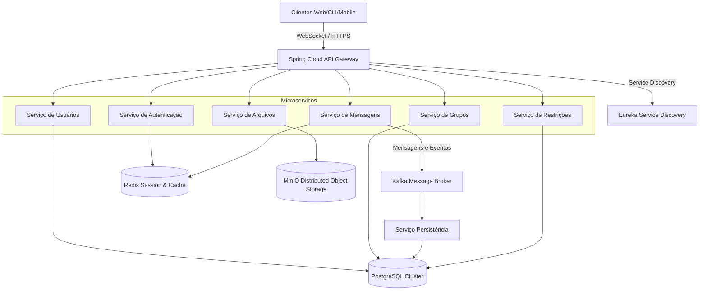
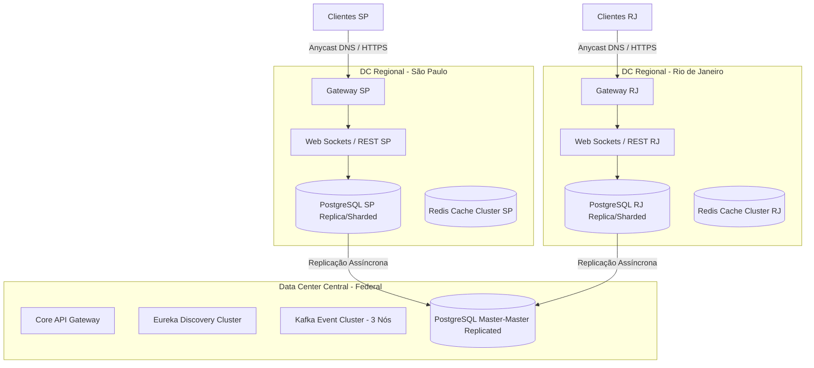

# DOCUMENTO DE ARQUITETURA DE SOFTWARE
## Sistema Distribuído de Comunicação Corporativa e Soberana (ChatGov)

---

### 1. INTRODUÇÃO

#### 1.1 Contexto e Justificativa
O cenário geopolítico e tecnológico contemporâneo exige que estados nacionais protejam suas comunicações estratégicas. O uso de plataformas internacionais (como WhatsApp, Microsoft Teams e Google Workspace) por órgãos do governo federal, estadual e municipal apresenta riscos à soberania digital, privacidade de dados sensíveis e conformidade legal (especialmente no que tange à Lei Geral de Proteção de Dados - LGPD).

O **ChatGov** é concebido como uma plataforma de comunicação corporativa unificada, segura, distribuída e resiliente, voltada para a federação nacional composta por mais de 30 estados. Suas operações abrangem os três poderes da República (Executivo, Legislativo, Judiciário), além de órgãos de controle independentes (como Ministério Público e Tribunais de Contas). O sistema deve lidar com fluxos de comunicação confidenciais e possuir alta disponibilidade e tolerância a falhas extremas (como isolamento de regiões ou desastres de infraestrutura).

#### 1.2 Escopo do Sistema
O escopo principal é fornecer uma plataforma integrada de troca de mensagens de texto, áudio, chamadas e transferência de arquivos, gerenciando rigorosamente as políticas de restrição de comunicação entre diferentes órgãos públicos (por exemplo, limitar a comunicação direta entre certos setores do Judiciário e do Executivo durante períodos específicos).

#### 1.3 Definições e Acrônimos
*   **E2EE**: *End-to-End Encryption* (Criptografia de Ponta a Ponta)
*   **ICP-Brasil**: Infraestrutura de Chaves Públicas Brasileira
*   **PoC**: *Proof of Concept* (Prova de Conceito)
*   **CRC32**: *Cyclic Redundancy Check 32-bit*
*   **Lamport Timestamp**: Algoritmo para ordenação lógica de eventos em sistemas distribuídos.
*   **RTO / RPO**: *Recovery Time Objective* / *Recovery Point Objective*

---

### 2. VISÃO GERAL DA ARQUITETURA

O ChatGov adota uma **Arquitetura Híbrida Distribuída** baseada em **Microsserviços Event-Driven** e **Topologia Federada**. 



#### 2.1 Justificativa Técnica da Escolha Arquitetural
1.  **Federação e Autonomia Regional**: Uma topologia federada permite que cada estado hospede seus próprios servidores de aplicação e bancos de dados de usuários e grupos, mantendo a autonomia em caso de falha de rede nacional (particionamento de rede).
2.  **Microsserviços Desacoplados**: A separação das responsabilidades em microsserviços (Usuários, Mensagens, Arquivos, Restrições) garante escalabilidade independente. Por exemplo, o serviço de mensagens (WebSocket) exige alta concorrência de I/O, enquanto o serviço de arquivos exige alta largura de banda.
3.  **Arquitetura Baseada em Eventos**: O uso do Apache Kafka como message broker assegura a entrega assíncrona, tolerância à oscilação de tráfego (backpressure) e ordenação por chaves de partição, garantindo consistência causal.

---

### 3. ARQUITETURA LÓGICA

O sistema está decomposto em módulos de serviços focados, implementados utilizando Java 17+, Spring Boot 3.x, Spring Cloud e bancos de dados adequados para cada tipo de persistência.

#### 3.1 Componentes e Serviços
1.  **API Gateway (Spring Cloud Gateway)**: Ponto de entrada único para todos os clientes. Executa a terminação TLS, roteamento dinâmico, rate-limiting e pré-validação de tokens JWT.
2.  **Serviço de Autenticação (OAuth2/JWT + ICP-Brasil)**: Realiza a autenticação via usuário/senha tradicionais ou por meio de certificados digitais e-CPF/e-CNPJ compatíveis com a ICP-Brasil.
3.  **Serviço de Usuários**: Gerencia o diretório hierárquico estruturado da federação (ex: `br.gov.executivo.ministerio-da-fazenda.usuario`).
4.  **Serviço de Mensagens (WebSocket/STOMP e HTTP)**: Gerencia as sessões WebSocket ativas mantendo o estado de presença e roteando as mensagens 1:1 e em grupo.
5.  **Serviço de Grupos**: Criação e controle de membros em canais de comunicação.
6.  **Serviço de Restrições (Políticas Governamentais)**: Motor de regras dinâmicas que avalia se o usuário $A$ tem permissão legal de enviar mensagens para o usuário $B$ ou ingressar no grupo $G$.
7.  **Serviço de Arquivos (Storage Gateway)**: Realiza o upload/download seguro de mídias, enviando os dados brutos criptografados em repouso para o MinIO (S3 compatible) e salvando metadados no banco.
8.  **Redis Cache & Broker**: Utilizado como cache distribuído de sessões, lista de usuários online (presença) e gerenciamento de locks distribuídos com Redlock.

---

### 4. ARQUITETURA FÍSICA E IMPLANTAÇÃO

O sistema foi desenhado para ser implantado de forma geograficamente distribuída em múltiplos data centers nacionais (Data Centers Regionais dos Estados + Data Center Central Federal).



#### 4.1 Infraestrutura e Redundância
*   **Load Balancing**: DNS Anycast direciona o tráfego do cliente ao Data Center geograficamente mais próximo. Um proxy Nginx/HAProxy local distribui as requisições para os nós do Spring Cloud Gateway.
*   **Service Discovery**: Spring Cloud Eureka gerencia dinamicamente o registro de novas instâncias de microsserviços.
*   **Armazenamento Distribuído**: MinIO operando em modo distribuído multi-tenant com replicação síncrona entre nós do mesmo DC e replicação assíncrona interestadual.

---

### 5. PROTOCOLOS E COMUNICAÇÃO

#### 5.1 Protocolo de Aplicação Customizado (TCP Custom Protocol)
Para comunicações de baixo nível e alta eficiência na PoC, definiu-se um protocolo binário direto sobre sockets TCP. A estrutura é dividida em cabeçalho rígido de 14 bytes e corpo dinâmico (payload).

##### Estrutura do Frame (Cabeçalho de 14 Bytes):
1.  **Magic Number** (4 bytes): `0x43484154` (Equivale aos caracteres "CHAT"). Usado para validação de integridade da conexão.
2.  **Version** (1 byte): Versão atual do protocolo (`0x01`).
3.  **Message Type** (1 byte):
    *   `0x01` (LOGIN)
    *   `0x02` (TEXT)
    *   `0x03` (FILE_START)
    *   `0x04` (FILE_CHUNK)
    *   `0x05` (ACK)
    *   `0x06` (ERROR)
    *   `0x07` (BROADCAST)
    *   `0x08` (LOGOUT)
4.  **Payload Length** (4 bytes): Representação inteira de 32 bits (Big-Endian) indicando o tamanho do payload a seguir.
5.  **Checksum** (4 bytes): Valor CRC32 (32 bits) calculado sobre os bytes do payload para detecção de corrupção física dos bits.

```
 0                   1                   2                   3
 0 1 2 3 4 5 6 7 8 9 0 1 2 3 4 5 6 7 8 9 0 1 2 3 4 5 6 7 8 9 0 1
+-+-+-+-+-+-+-+-+-+-+-+-+-+-+-+-+-+-+-+-+-+-+-+-+-+-+-+-+-+-+-+-+
|                       Magic (0x43484154)                      |
+-+-+-+-+-+-+-+-+-+-+-+-+-+-+-+-+-+-+-+-+-+-+-+-+-+-+-+-+-+-+-+-+
|    Version    |   Msg Type    |         Payload Length        |
+-+-+-+-+-+-+-+-+-+-+-+-+-+-+-+-+-+-+-+-+-+-+-+-+-+-+-+-+-+-+-+-+
|        Payload Length (cont)  |            Checksum           |
+-+-+-+-+-+-+-+-+-+-+-+-+-+-+-+-+-+-+-+-+-+-+-+-+-+-+-+-+-+-+-+-+
|        Checksum (cont)        |   Payload (Bytes variáveis)   |
+-+-+-+-+-+-+-+-+-+-+-+-+-+-+-+-+-+-+-+-+-+-+-+-+-+-+-+-+-+-+-+-+
```

#### 5.2 Protocolos Auxiliares e Formatos de Serialização
*   **REST/HTTP**: Utilizado para endpoints administrativos (cadastro de novos órgãos públicos, auditoria, configurações globais) retornando objetos serializados em **XML**.
*   **WebSockets (com STOMP)**: Utilizado em produção para conexões bidirecionais persistentes. O protocolo de transporte TCP subjacente garante entrega confiável em ordem.

#### 5.3 Modelo de Comunicação (Síncrono vs. Assíncrono)
*   **Síncrono (HTTP/REST)**: Usado para operações em que a resposta imediata é mandatória, como autenticação de usuário e validações do motor de restrições.
*   **Assíncrono (Publish/Subscribe via Kafka)**: Toda entrega de mensagem de chat é publicada em tópicos do Kafka (ex: `chat.messages.v1`). Isso garante que, mesmo que o destinatário final esteja offline, a mensagem seja persistida nos brokers e entregue sob demanda. A ordenação causal é mantida particionando as mensagens pela chave do ID da conversa (UUID).

---

### 6. MODELO DE DADOS E ARMAZENAMENTO

O sistema adota uma abordagem híbrida de banco de dados: **PostgreSQL** para dados estruturados/consistência forte e **Redis Cluster** para sessões rápidas e enfileiramento de presença.

```
      +------------------+                    +------------------+
      |      ÓRGÃO       |                    |     USUÁRIO      |
      +------------------+                    +------------------+
      | PK | ID (UUID)   |<-------------------| PK | ID (UUID)   |
      |    | Nome        |                    | FK | Org_ID      |
      |    | Hierarquia  |                    |    | Nome        |
      +------------------+                    |    | Username    |
                                              |    | Digital_Cert|
                                              +------------------+
                                                       ^
                                                       |
                                                       | (1:N)
      +------------------+                    +------------------+
      |  RESTRIÇÃO_COMUM |                    |     MENSAGEM     |
      +------------------+                    +------------------+
      | PK | ID (UUID)   |                    | PK | ID (UUID)   |
      | FK | Org_Orig_ID |                    | FK | Sender_ID   |
      | FK | Org_Dest_ID |                    | FK | Dest_ID     |
      |    | Bloqueado   |                    |    | Payload     |
      +------------------+                    |    | Timestamp   |
                                              |    | Vector_Clock|
                                              +------------------+
```

#### 6.1 Estrutura de Tabelas Principais (Esquema Conceitual)
1.  **Usuario**: `id` (UUID), `username` (VARCHAR), `nome` (VARCHAR), `cargo` (VARCHAR), `matricula` (VARCHAR), `org_id` (UUID), `pub_key` (TEXT), `status` (VARCHAR).
2.  **Orgao**: `id` (UUID), `nome` (VARCHAR), `sigla` (VARCHAR), `esfera` (VARCHAR - Executivo/Judiciário/etc), `estado` (VARCHAR - 2 letras), `parent_id` (UUID).
3.  **Grupo**: `id` (UUID), `nome` (VARCHAR), `org_owner_id` (UUID), `tipo` (VARCHAR - Privado/Institucional).
4.  **Mensagem**: `id` (UUID), `sender_id` (UUID), `recipient_id` (UUID - NULL para grupo), `grupo_id` (UUID - NULL para 1:1), `payload_encrypted` (BYTEA), `timestamp_lamport` (BIGINT), `checksum_crc` (VARCHAR).

---

### 7. SEGURANÇA E PRIVACIDADE (COMPLIANCE E LGPD)

#### 7.1 Criptografia End-to-End (E2EE)
O chatGov protege a confidencialidade absoluta das mensagens utilizando o protocolo de criptografia ponta a ponta (baseado no algoritmo *Double Ratchet*). 
*   **Geração de Chaves**: No registro, os clientes geram um par de chaves Identity, Ephemeral e Prekeys (usando curvas elípticas Curve25519) e publicam no Serviço de Usuários.
*   **Troca de Chaves**: A sessão criptografada é estabelecida via algoritmo Diffie-Hellman (X3DH). A chave simétrica gerada (AES-256-GCM) é rotacionada a cada mensagem enviada, garantindo *Perfect Forward Secrecy* (PFS).

#### 7.2 Autenticidade e Não-Repúdio
Para garantir que as mensagens e os arquivos não possam ter sua autoria negada:
*   **Assinatura Digital Corporativa**: Todas as mensagens contêm um cabeçalho de assinatura contendo o hash da mensagem cifrado com a chave privada RSA/ECDSA do emissor (vinculada ao certificado ICP-Brasil em tokens físicos A3 ou nuvem segura).
*   **Logs de Auditoria Imutáveis**: Um microsserviço de auditoria ingere eventos do Kafka e os insere em tabelas do tipo append-only em bancos de dados que utilizam ledger imutável, permitindo verificar a integridade temporal do log de acessos.

---

### 8. ESCALABILIDADE HORIZONTAL E VERTICAL

O ChatGov é planejado para suportar picos de mais de **100.000 usuários simultâneos** mantendo baixa latência (< 200ms por mensagem).

#### 8.1 Divisão e Particionamento de Dados (Sharding)
Como a federação é dividida em estados, os dados de usuários e históricos de mensagens são particionados por região utilizando **Database Sharding** baseado no código do estado (ex: `br-sp`, `br-rj`). Um banco global federado armazena o diretório de roteamento para localizar em qual shard o usuário está registrado.

#### 8.2 Caching Distribuído
*   **Redis Cluster**: Armazena dados voláteis (tokens JWT activos, mapeamento de ID de usuário -> ID de conexão socket, estados de digitação e presença online). 
*   **CDNs Internas**: Arquivos de mídia transferidos com alta frequência são distribuídos em nós locais de CDN do governo federal espalhados pelas capitais, otimizando a banda de rede governamental.

---

### 9. TOLERÂNCIA A FALHAS E ALTA DISPONIBILIDADE

#### 9.1 Detecção de Falhas
*   **Heartbeats**: Conexões WebSocket ativas enviam quadros de ping/pong a cada 10 segundos. A ausência de 3 heartbeats consecutivos marca o usuário como offline no Redis.
*   **Circuit Breakers (Resilience4j)**: O acesso ao microserviço de restrições de comunicação é encapsulado em um Circuit Breaker. Se o serviço falhar, o sistema entra em modo de falha seguro (*fail-safe*), bloqueando preventivamente novas interações inter-órgãos que dependam de validação complexa, enquanto permite mensagens intra-órgãos.

#### 9.2 Recuperação de Falhas e Objetivos de SLA
*   **Fila Dead Letter (DLQ)**: Mensagens que não puderam ser roteadas por falhas nos microsserviços são enviadas a uma fila DLQ do Kafka para reprocessamento manual ou automático.
*   **SLA Objetivo**:
    *   **Uptime**: 99.9% anual.
    *   **RTO (Recovery Time Objective)**: < 5 minutos em caso de queda de um nó principal.
    *   **RPO (Recovery Point Objective)**: < 1 minuto (garantido pela replicação em tempo real dos logs de transações do PostgreSQL e commits imediatos do Kafka).

---

### 10. TRANSPARÊNCIAS DO SISTEMA DISTRIBUÍDO

1.  **Transparência de Acesso**: Os clientes (CLI, Web, Mobile) utilizam a mesma biblioteca cliente que padroniza as chamadas de rede e serialização, escondendo as diferenças do sistema operacional subjacente.
2.  **Transparência de Localização**: O cliente conecta-se apenas ao endereço unificado do API Gateway. A descoberta física dos nós de backend que processarão a requisição é feita dinamicamente através do Eureka Service Discovery.
3.  **Transparência de Replicação**: O banco de dados centralizado em PostgreSQL realiza a replicação automática em tempo real. O programador escreve código interagindo com o banco como se ele fosse único; as réplicas de leitura são gerenciadas de forma transparente pelo driver de banco de dados (*read-write splitting*).
4.  **Transparência de Concorrência**: Para evitar race conditions durante a alteração concorrente de um grupo governamental por múltiplos administradores, o sistema utiliza locks distribuídos no Redis por meio da biblioteca **Redisson**, implementando exclusão mútua distribuída.
5.  **Transparência de Falha**: Se um nó do microsserviço de mensagens cair, o Load Balancer redireciona a conexão TCP/WebSocket do cliente para outra instância disponível de forma invisível para o usuário, que percebe apenas uma rápida reconexão de frações de segundo.

---

### 11. PROTÓTIPO (PoC)

O protótipo implementado (PoC) visa comprovar a viabilidade e eficiência do protocolo TCP binário customizado de baixo nível. O código-fonte está estruturado de forma desacoplada para isolar a lógica do servidor de socket TCP e o console de comandos do cliente (CLI).

#### 11.1 Características Finais da PoC
1.  **Conexões Concorrentes**: O servidor de socket monitora as requisições em uma thread dedicada e, ao aceitar conexões, transfere o socket para um pool de threads gerenciado (`ExecutorService`), garantindo concorrência limpa.
2.  **Roteamento 1:1 e Presença**: Clientes realizam login informando seus nomes de usuário. O servidor gerencia o mapa de usernames para sockets ativos.
3.  **Transferência de Arquivos**: O protocolo suporta a divisão de arquivos em frames com o tipo `0x04` (FILE_CHUNK). O cliente realiza a leitura do arquivo em blocos e reconstrói o arquivo no destino validando o checksum CRC32.

---

### 12. REFERÊNCIAS BIBLIOGRÁFICAS

1.  **LAMPORT, Leslie**. *Time, Clocks, and the Ordering of Events in a Distributed System*. Communications of the ACM, 1978.
2.  **KLEPPMANN, Martin**. *Designing Data-Intensive Applications*. O'Reilly Media, 2017.
3.  **COULOURIS, George; DOLLIMORE, Jean; KINDBERG, Tim**. *Distributed Systems: Concepts and Design*. 5th ed. Addison-Wesley, 2011.
4.  **RFC 6455**. *The WebSocket Protocol*. IETF, 2011.
5.  **RFC 5246**. *The Transport Layer Security (TLS) Protocol Version 1.2 / 1.3*. IETF, 2008/2018.
